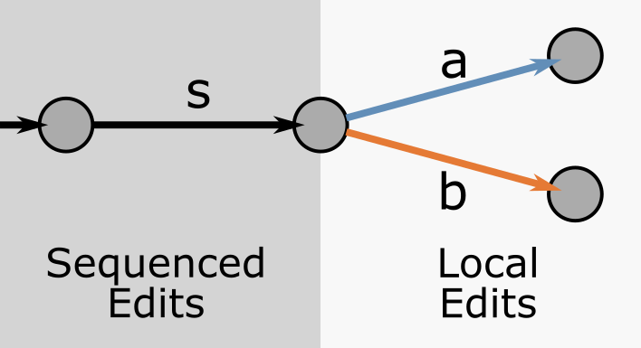
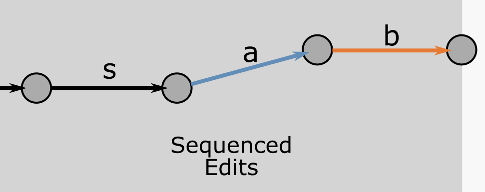

# Merge Resolution

## Purpose

Merge resolution is the process through which the changes made by one client are adapted so that they can apply to the current state of the document.
This is necessary because other clients may have concurrently made other changes to the document.

Consider a scenario where two clients A and B each make a local edit to the globally consistent state defined by the last sequenced edit s.
These local changes could be represented as diverging branches in a versioning diagram (Figure 1).

<figure align="center">
    
    <figcaption>
        Figure 1. Client A has applied local edit a to the globally consistent state defined by the last sequenced edit s.
        Client B has done similarly with edit b.
        (Vertices represent document states, arrows represent edits)
    </figcaption>
</figure>

If edit `a` were to be sequenced before edit `b`, then edit `a` would be applied to the state after edit `s`.
All clients would therefore apply edit `b` to the document state resulting from edit `a` (Figure 2).

<figure align="center">
    
    <figcaption>
        Figure 2. All clients have received the sequenced edits a and b.
        They apply edit b to the document state resulting from edit a.
    </figcaption>
</figure>

Note how edit `b` was originally authored to be applied to the state after edit `s`,
but ends up being applied to the state after edit `a`.
This may require `b` to be updated so that it has a similar effect on the state after edit `a` as it would have had on the sate after edit `s`.

For example,
if edit `b` meant to change the value of some node at index `n` in a sequence of nodes,
and if edit `a` inserted two additional nodes at the start of that same sequence,
then edit `b` would need to be updated to change the value of the node at index `n+2`.

## User Intentions

We use the term "user intention" to refer to the intention of the user when performing an edit on a given document state.

For example,
a user deleting some node at index `n` in a sequence of nodes is typically attempting to delete that specific node,
independently of where that node happens to be in the current document state.
The user intention is therefore to delete that node,
not to delete whatever node happens to be at index `n`.

This is an important difference because concurrent edits might change the position of that node in the sequence,
or even move that node to a different sequence.

User intentions determine which outcome ought to be produced by the merge resolution process in the face of concurrent edits.

A key part of SharedTree's design is therefore the set of editing intentions it allows applications to express and the specific merge outcomes these intentions yield.
See [Supported Intentions](./supported-intentions/README.md) for a list intentions supported by SharedTree out of the box.

The set of editing intentions supported by SharedTree is extensible in two ways:
* High-level intentions can be modeled with commands.
* New kinds of edits can be supported through new `ChangeFamilies`.

## Commands

A command is a sequence of low-level edits or other commands that is given a identity (i.e., a unique name).
Commands form trees of edits where non-root nodes are sub-commands.

Commands extend SharedTree's ability to capture editing intentions by allowing application-specific code
to be re-executed in order to produce the low-level edits that are applied to the document.

For example, a "Sort" command that was issued on a sequence would be re-executed in the face of concurrent changes to that sequence.
The re-execution of the command on the state brought about by concurrent would yield a new sequence of low-level edits that would then be sent again as a new attempt to perform the edit.

See [Semantic Format](../semantic-format/README.md) for more details.

## Change Families

A change family is a library of potential edits that a SharedTree instance can be parametrized with to support.

For example the `SequenceChangeFamily` offers facilities for making edits to fields of the sequence kind.

## Field Kinds

When considering what kind of data is represented by a given part of the document,
application authors typically have a clear idea of the kinds of edits that make sense for that data.
Each field in a SharedTree document is assigned a specific field kind through its schema definition.
Each field kind constitutes an abstract data model that all edits applied to it must follow.

For example, the `Value` field kind is associated with fields that must contain exactly one node.
All edits for this field kind must therefore have merge resolutions that preserve this invariant.

See the Cell Model for more details on the core idea behind field kinds.
