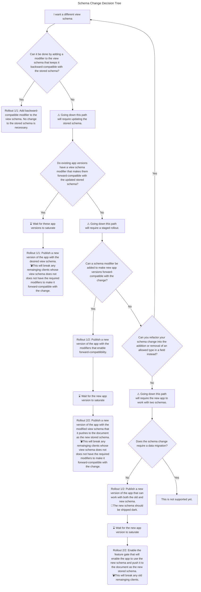

The first table gives a detailed explanation of the columns used in the second table.

| Column Header                                          | Column Meaning                                                                                                                                                                                       | Additional Notes                                                                                                                                                 |
| ------------------------------------------------------ | ---------------------------------------------------------------------------------------------------------------------------------------------------------------------------------------------------- | ---------------------------------------------------------------------------------------------------------------------------------------------------------------- |
| Change to Stored Schema                                | The schema change under consideration                                                                                                                                                                |                                                                                                                                                                  |
| Data Migration                                         | Whether making the change the stored schema would require a data migration                                                                                                                           |                                                                                                                                                                  |
| Read Back-Compatibility                                | Whether making the change the stored schema would break document reading on clients whose view schema matched the old stored schema                                                                  | Broken if clients with a view schema that matches the old stored schema may read data that is invalid for their view schema.                                     |
| Write Back-Compatibility                               | Whether making the change the stored schema would break document writing on clients whose view schema matched the old stored schema                                                                  | Broken if clients with a view schema that matches the old stored schema may write data that is invalid for the new stored schema.                                |
| Avoidable Through Backward-Compatible View Schema Mods | Whether and how the stored schema upgrade can be avoided by using modifiers on the desired view schema to make it backward-compatible with the unchanged stored schema.                               | Pushing a stored schema upgrade using a view schema will not lead to stored schema changes where these modifiers are used.                                       |
| Tolerable Through Forward-Compatible View Schema Mods  | Whether and how the upgrade can be tolerated by clients with a view schema that matches the old schema thanks to modifiers that make their view schema forward-compatible with the new stored schema | Aside from "runtime check on write", pushing a stored schema upgrade using a view schema may lead to stored schema changes even though these modifiers are used. |
| Recommended Path                                       | The recommended approach to enable app code to use a view schema that reflects the change.                                                                                                           |                                                                                                                                                                  |
| Difficulty                                             | How challenging the recommended path may be.                                                                                                                                                         |                                                                                                                                                                  |

| Change to Stored Schema      | Data Migration | Read Back-Compatibility | Write Back-Compatibility | Avoidable Through Backward-Compatible View Schema Mods | Tolerable Through Forward-Compatible View Schema Mods | Recommended Path                                                                         | Difficulty |
| ---------------------------- | -------------- | ----------------------- | ------------------------ | ------------------------------------------------------ | ----------------------------------------------------- | ---------------------------------------------------------------------------------------- | ---------- |
| Rename Node Type             | ❕ Required     | ❌ Broken                | ❌ Broken                 | ⌛ aliasType                                            | ❌ Never                                               | Backward-compatible view schema mod                                                      | 🌶         |
| Rename Field Key             | ❕ Required     | ❌ Broken                | ❌ Broken                 | ⌛ aliasField                                           | ❌ Never                                               | Backward-compatible view schema mod                                                      | 🌶         |
| Map Node → Object Node       | ✔ None         | ✔ Maintained            | ❌ Broken                 | ⌛ asObject                                             | ⌛ Runtime check on write                              | Backward-compatible view schema mod                                                      | 🌶         |
| Object Node → Map Node       | ✔ None         | ❌ Broken                | ✔ Maintained             | ⌛ Runtime check on write                               | ✅ allowUnknownOptionalFields                          | Forward-compatible view schema mod                                                       | 🌶🌶       |
| Add Allowed Type in Field    | ✔ None         | ❌ Broken                | ✔ Maintained             | ⌛ Runtime check on write                               | ⌛ allowUknownType                                     | Forward-compatible view schema mod                                                       | 🌶🌶       |
| Remove Allowed Type in Field | ❕ Required     | ✔ Maintained            | ❌ Broken                 | ⌛ retireType                                           | ⌛ Runtime check on write                              | Backward-compatible view schema mod                                                      | 🌶         |
| Add Non-Required Field       | ✔ None         | ❌ Broken                | ✔ Maintained             | ⌛ Runtime check on write                               | ✅ allowUnknownOptionalFields                          | Forward-compatible view schema mod                                                       | 🌶🌶       |
| Remove Non-Required Field    | ❕ Required     | ✔ Maintained            | ❌ Broken                 | ⌛ retireField                                          | ⌛ Runtime check on write                              | Backward-compatible view schema mod                                                      | 🌶         |
| Add Required Field           | ❕ Required     | ❌ Broken                | ❌ Broken                 | ❌ Never                                                | ⌛ allowUnknownRequiredFields (RO)                     | Read-only forward-compatible view schema mod OR Staged schema upgrade w/ data migration | 🌶🌶🌶   |
| Remove Required Field        | ❕ Required     | ❌ Broken                | ❌ Broken                 | ⌛ retireField (RO)                                     | ❌ Never                                               | Read-only backward-compatible view schema mod OR staged schema upgrade w/ data migration | 🌶🌶🌶     |

